# Auditoria de identidade visual — eliseu.io

Data: 27 de julho de 2026  
Escopo: landing page atual em desktop e mobile  
Objetivo do usuário: entender rapidamente que a Eliseu.io simplifica processos e sistemas sob medida, confiar na execução direta com Eliseu e iniciar uma conversa pelo WhatsApp.

## Veredito

A página já tem uma identidade forte nas áreas certas: header, Hero, Sobre mim, CTA final e footer comunicam uma marca clara, humana e tecnicamente competente. A sensação de mistura vem do miolo da página, que alterna entre três gramáticas visuais sem uma regra comum:

1. editorial clean e curvo;
2. terminal técnico em dark mode;
3. dashboard corporativo com cards, timelines e pipelines.

O caminho recomendado não é trocar a marca, mas escolher uma dessas gramáticas como base e limitar as outras a papéis específicos.

## Evidência capturada

### Desktop

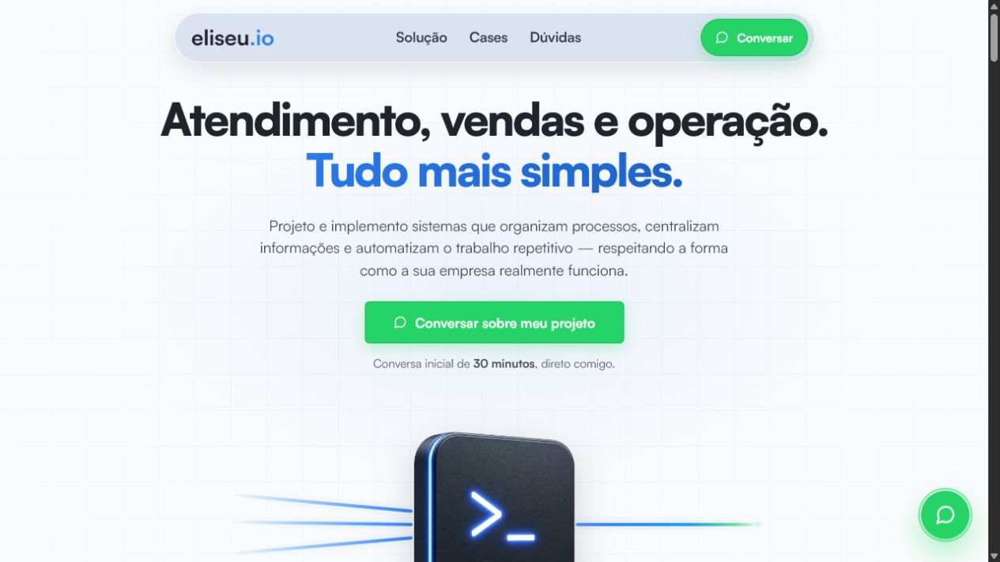

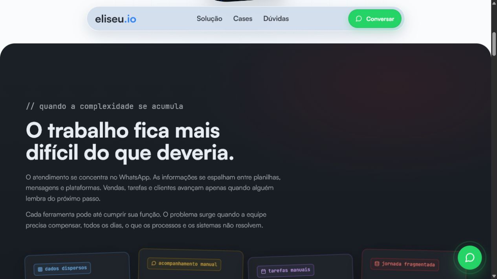

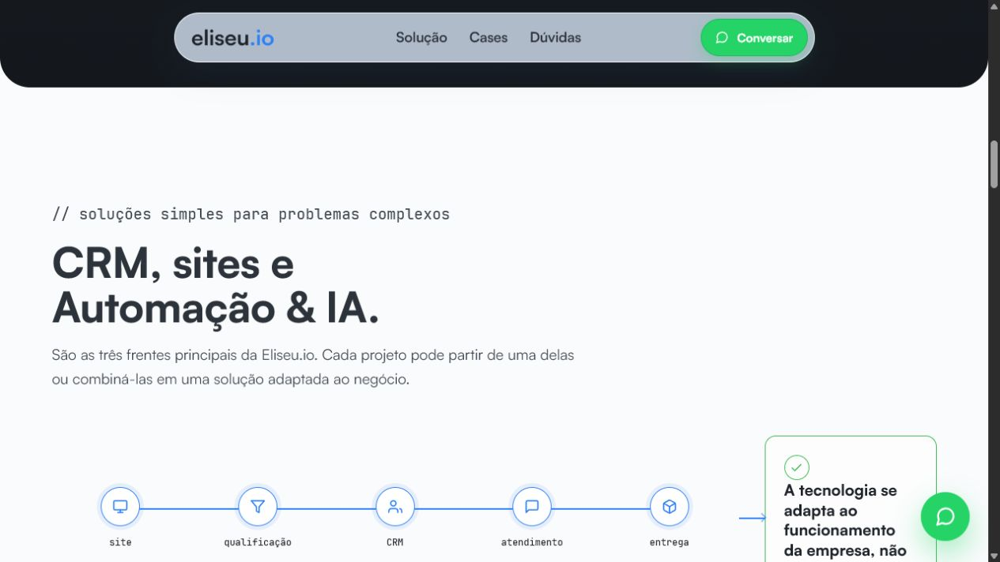

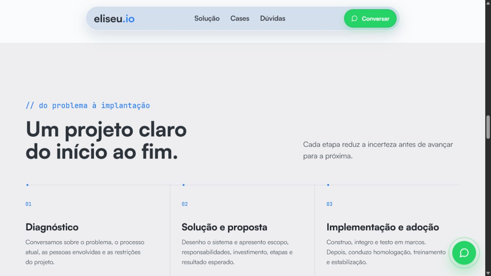

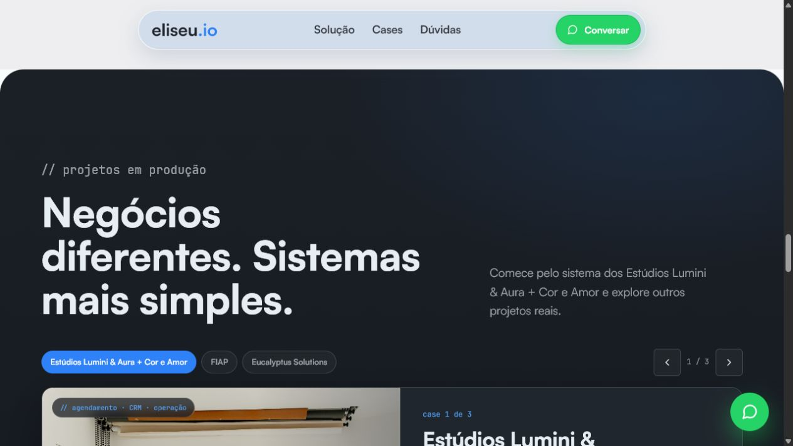

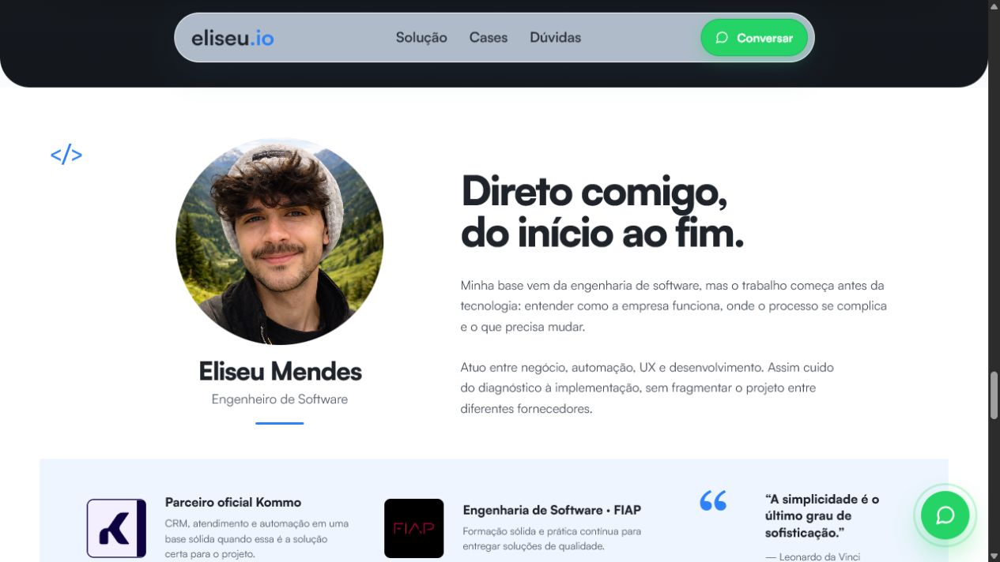

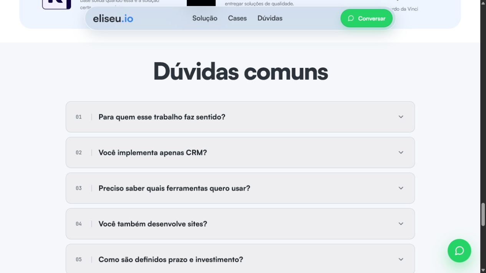

### Mobile

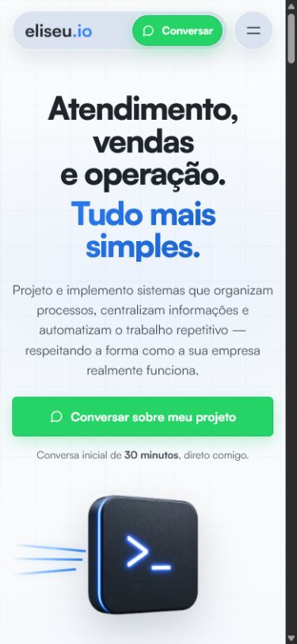

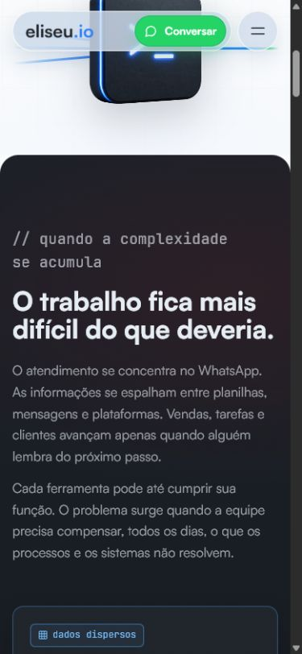

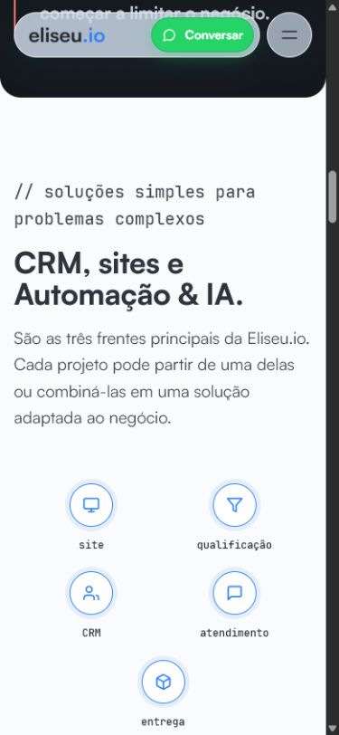

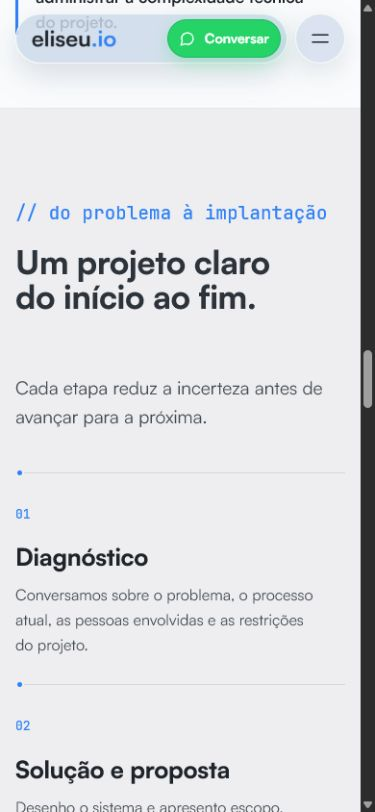

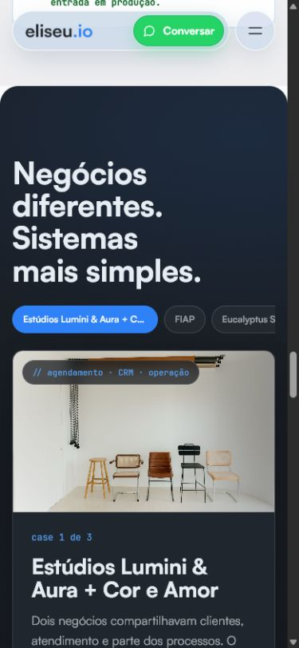

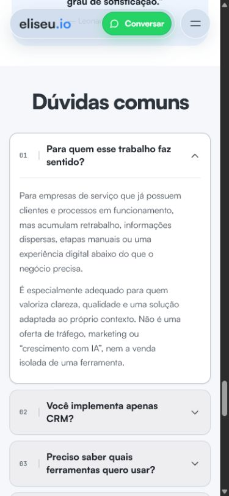

## O que já funciona

- **Marca reconhecível:** azul, tipografia Satoshi, assinatura mono e terminal 3D criam lembrança.
- **Promessa clara no Hero:** o título é direto, específico e tem boa hierarquia.
- **Curvas com personalidade:** header e grandes capítulos arredondados dão um caráter clean sem parecer genérico.
- **Tom humano:** Sobre mim reduz risco percebido e diferencia a oferta de uma agência impessoal.
- **Conversão explícita:** CTA do WhatsApp é fácil de encontrar e o CTA final fecha a narrativa.
- **Base semântica razoável:** títulos seguem hierarquia, os cases têm controles nomeados e o foco visível está previsto no CSS.

## Mapa de tensões

### 1. Três identidades disputam o miolo

O Hero e o Sobre mim são editoriais e leves. Problema e Cases são capítulos dark com linguagem de terminal. Solução e Processo usam diagramas e estruturas de dashboard. Cada seção funciona isoladamente, mas a rolagem parece uma coleção de landing pages diferentes.

### 2. A cor não tem uma hierarquia única

Azul é a marca, verde é conversão e, no Problema, vermelho, amarelo e roxo também viram acentos. Como todos aparecem em componentes de destaque, o usuário não sabe se a cor comunica marca, status, urgência ou ação.

Regra sugerida:

- azul: marca, estrutura e estado ativo;
- verde: somente ação ligada ao WhatsApp e confirmação real;
- vermelho/amarelo: apenas estados funcionais que realmente precisem dessas semânticas;
- roxo: remover do sistema principal.

### 3. Curvas existem, mas não formam uma escala

O header é uma pill; capítulos usam cantos próximos de 48 px; cards oscilam entre 10 e 18 px; botões voltam a 6–10 px. O resultado mantém a ideia “curva”, mas não a sensação de sistema.

Escala sugerida:

- 48 px: capítulos e grandes superfícies;
- 20 px: módulos e cards;
- 12 px: inputs, accordions e botões retangulares;
- 999 px: navegação, tags e ações que são realmente pills.

### 4. O dark mode virou pontuação recorrente

Problema, Cases e CTA final são grandes blocos escuros. Em vez de aumentar a importância de um momento, a repetição cria uma página em “xadrez”. O dark deve ter um papel explícito: diagnóstico, prova ou fechamento.

### 5. A assinatura mono está perto de virar tema

JetBrains Mono funciona muito bem em eyebrows, números e pequenas evidências. Quando aparece em tags, labels, chips e diagramas, a marca começa a parecer orientada a desenvolvedores, enquanto a proposta fala com donos e gestores de empresas de serviço.

### 6. A transformação é contada por metáforas concorrentes

- Problema: quatro cards inclinados e coloridos.
- Solução: pipeline horizontal.
- Processo: timeline de três colunas.

Esses três blocos deveriam parecer partes da mesma história: sinais dispersos → desenho do sistema → implantação.

### 7. Cases têm prova, mas também ruído de interface

Imagem, seletor por chips, setas, contador, tags, detalhes expansíveis, CTA e pontos de paginação competem pela atenção. No mobile, os chips truncam títulos e criam um carrossel visualmente apertado. A história principal deveria caber em uma imagem, um contexto curto, um resultado e uma ação.

### 8. FAQ parece administrativo

As caixas cinza grandes lembram configurações ou formulário. No estado aberto, uma única resposta ocupa quase toda a tela mobile. Linhas compactas, divisores e um estado aberto editorial combinam melhor com a identidade desejada.

### 9. WhatsApp domina mais que a marca

Há CTA verde no header, Hero, Cases, FAQ/CTA e um botão flutuante com glow. O verde ganha mais presença que o azul. O botão flutuante também sobrepõe conteúdo em diversos capítulos. A recomendação é remover o flutuante ou torná-lo discreto após o primeiro CTA sair da tela.

### 10. Ritmo e âncoras no mobile

O header móvel é largo para a viewport e reduz a área útil. As capturas por âncora mostram sobras do capítulo anterior e risco de conteúdo ficar próximo demais do header fixo. Cases também apresentam truncamento nos seletores.

## Riscos de acessibilidade

Observáveis nas capturas:

- texto secundário cinza em superfícies dark pode ficar abaixo de contraste confortável;
- labels mono pequenas e coloridas pedem validação de contraste e tamanho;
- o botão flutuante pode cobrir informação e controles;
- chips truncados no mobile diminuem clareza e tamanho efetivo do alvo;
- o FAQ fechado parece visualmente desabilitado por causa do cinza de fundo;
- âncoras com header fixo precisam de `scroll-margin-top`.

Pontos positivos observáveis:

- boa escala dos títulos;
- CTAs grandes;
- foco visível está definido no CSS;
- estrutura de headings e nomes acessíveis dos controles é razoável.

Limite da evidência: as capturas não comprovam contraste calculado, navegação completa por teclado, leitura por tecnologia assistiva, redução de movimento ou zoom a 200%. Esses pontos precisam de teste técnico separado.

## Saúde por etapa da página

1. **Header — forte.** Reconhecível, simples e coerente; precisa apenas de ajuste de largura/offset no mobile.
2. **Hero — forte.** Melhor síntese da marca atual; deve ser a fonte do novo sistema.
3. **Problema — frágil.** Boa mensagem, mas o dark dramático, cards inclinados e quatro cores criam uma personalidade paralela.
4. **Solução — intermediária.** Conteúdo claro; o pipeline e os cards aproximam a marca de um SaaS genérico.
5. **Processo — frágil.** Legível, porém corporativo e desconectado do ritmo curvo e humano das seções fortes.
6. **Cases — intermediária.** Prova visual valiosa, mas excesso de controles e densidade; maior tensão no mobile.
7. **Sobre mim — forte.** Humano, autoral e com bom equilíbrio entre foto, narrativa e credenciais.
8. **FAQ — intermediária.** Funcional, mas pesado e administrativo; o estado aberto domina a viewport.
9. **CTA final e footer — forte.** Fechamento seguro e coerente; deve continuar como principal uso do dark mode.

## Regras invariantes recomendadas

Independentemente da direção escolhida:

- usar Satoshi como voz principal e JetBrains Mono como assinatura;
- azul como cor de marca e verde somente para conversão;
- adotar uma escala única de raios;
- escolher um único papel para dark mode;
- remover o arco-íris de alertas;
- conectar Problema, Solução e Processo por uma só metáfora de transformação;
- reduzir controles simultâneos em Cases;
- transformar FAQ em lista editorial compacta;
- limitar sombras e glows;
- garantir `scroll-margin-top`, contraste e ausência de sobreposição no mobile.

## Sets de design

### Orbital Claro

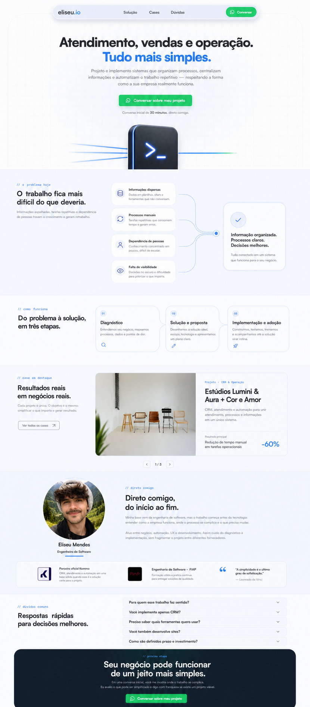

Quase toda a página vive em superfícies claras, com azul como único acento estrutural. Problema vira um fluxo calmo de sinais convergindo para uma saída organizada; Processo usa três módulos conectados; Cases ganha leitura editorial; dark fica reservado ao fechamento.

**Vantagem:** maior coerência com Hero, Sobre mim e a preferência por clean e curvo.  
**Risco:** perde parte do dramatismo técnico atual.

### Contraste Controlado

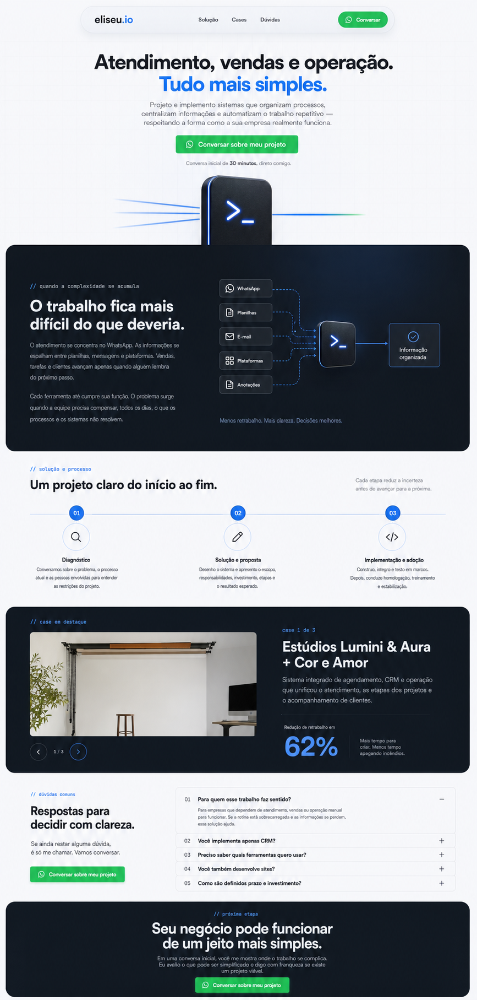

Preserva capítulos dark para diagnóstico e prova, mas unifica todos em azul + navy, elimina cards inclinados e limita o verde a ações. Solução e Processo passam a ser uma sequência única.

**Vantagem:** mantém o DNA atual com menos ruído.  
**Risco:** se o dark reaparecer em excesso durante a implementação, o efeito “xadrez” volta.

### Editorial Modular

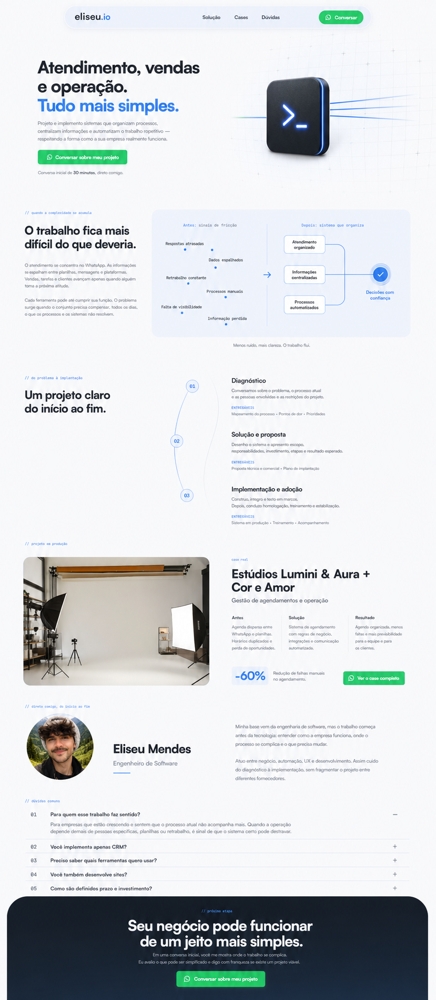

Usa mais assimetria, tipografia expressiva, superfícies suaves e módulos de prova contidos. Problema vira um antes/depois, Processo vira narrativa consultiva e Cases assume formato de história.

**Vantagem:** mais autoral, premium e humano.  
**Risco:** exige mais disciplina de composição e pode parecer menos “produto de software” se perder os sinais técnicos.

## Recomendação

**Orbital Claro** é a melhor base para o que já está validado pelo gosto do usuário. Ele preserva o Hero e o tom humano, corrige a fragmentação e deixa espaço para Problem, Solution e Process serem reconstruídos como uma única narrativa.

Se a preferência for manter mais contraste e a presença técnica atual, **Contraste Controlado** é a segunda melhor escolha.

